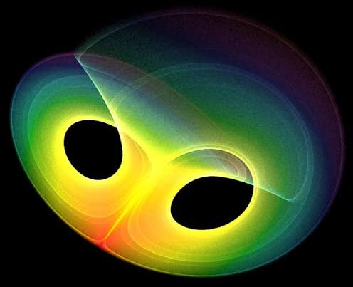
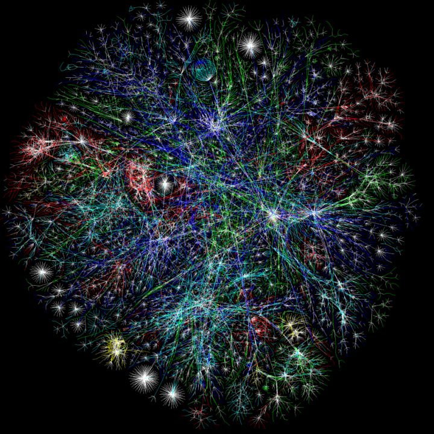
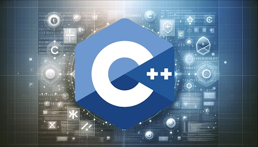
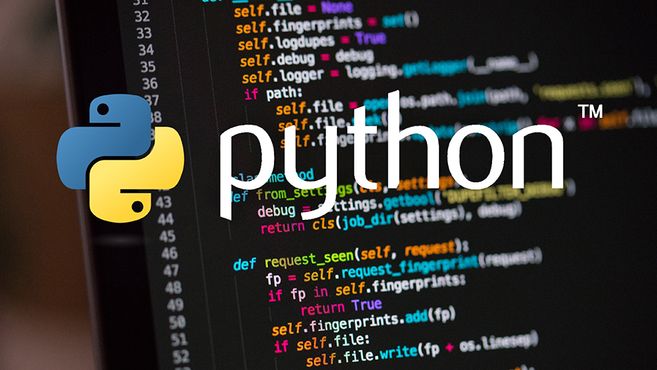
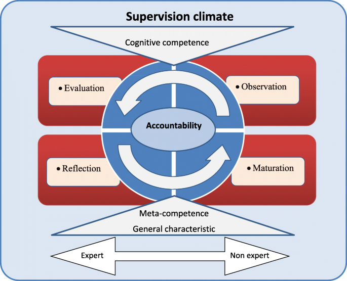

## Class 1

::: {.grid}

::: {.g-col-12 .g-col-md-2}

Mathematical Analysis

:::

::: {.g-col-12 .g-col-md-10}

**Introduction to Mathematical Analysis -- Nhập Môn Giải Tích Toán Học**

`semester`: summer 2025, summer 2026.

`GitHub repository`: [advanced STEM & beyond/analysis](https://github.com/NQBH/advanced_STEM_beyond/tree/main/analysis).

`resource`:

- final exam 2026: [test: [pdf](https://github.com/NQBH/advanced_STEM_beyond/blob/main/analysis/resource/analysis_final_term_exam_2026/NQBH_analysis_final_term_exam_2026.pdf), [TeX](https://github.com/NQBH/advanced_STEM_beyond/blob/main/analysis/resource/analysis_final_term_exam_2026/NQBH_analysis_final_term_exam_2026.tex)].

:::

:::

## Class 2

::: {.grid}

::: {.g-col-12 .g-col-md-2}

Combinatorics & Graph Theory.

:::

::: {.g-col-12 .g-col-md-10}

**Combinatorics & Graph Theory -- Tổ Hợp & Lý Thuyết Đồ Thị**:

`semester`: summer 2025, summer 2026.

`GitHub repository`: [advanced STEM & beyond/combinatorics](https://github.com/NQBH/advanced_STEM_beyond/tree/main/combinatorics).

`resource`:

- midterm exam 2025: [test: [pdf](https://github.com/NQBH/advanced_STEM_beyond/blob/main/combinatorics/resource/combinatorics_graph_theory_midterm_exam_2025/NQBH_combinatorics_graph_theory_midterm_exam_2025.pdf), [TeX](https://github.com/NQBH/advanced_STEM_beyond/blob/main/combinatorics/resource/combinatorics_graph_theory_midterm_exam_2025/NQBH_combinatorics_graph_theory_midterm_exam_2025.tex)], [solution: [pdf](https://github.com/NQBH/advanced_STEM_beyond/blob/main/combinatorics/resource/combinatorics_graph_theory_midterm_exam_2025/NQBH_combinatorics_graph_theory_midterm_exam_solution_2025.pdf). [TeX](https://github.com/NQBH/advanced_STEM_beyond/blob/main/combinatorics/resource/combinatorics_graph_theory_midterm_exam_2025/NQBH_combinatorics_graph_theory_midterm_exam_solution_2025.tex)].

- final exam 2026. [test: [pdf](https://github.com/NQBH/advanced_STEM_beyond/blob/main/combinatorics/resource/combinatorics_graph_theory_final_exam_2026/NQBH_combinatorics_graph_theory_final_exam_2026.pdf), [TeX](https://github.com/NQBH/advanced_STEM_beyond/blob/main/combinatorics/resource/combinatorics_graph_theory_final_exam_2026/NQBH_combinatorics_graph_theory_final_exam_2026.tex)].

:::

:::

## Class 3

::: {.grid}

::: {.g-col-12 .g-col-md-2}

Basic C/C++ Programming
:::

::: {.g-col-12 .g-col-md-10}

**Fundamentals of Programming -- Cơ Sở/Nhập Môn Lập Trình**
`semester`: summer 2025, summer 2026.

`resource`:

- final exam 2026: [test: [pdf](https://github.com/NQBH/advanced_STEM_beyond/blob/main/fundamental_programming/final_term/NQBH_fundamental_programming_final_term_2026.pdf), [TeX](https://github.com/NQBH/advanced_STEM_beyond/blob/main/fundamental_programming/final_term/NQBH_fundamental_programming_final_term_2026.tex)].

:::

:::

## Class 4

::: {.grid}

::: {.g-col-12 .g-col-md-2}

Basic Python Programming
:::

::: {.g-col-12 .g-col-md-10}

**Information Technology Fundamentals II**
`semester`: summer 2025, summer 2026.

[`lecture note`: [pdf](https://github.com/NQBH/advanced_STEM_beyond/blob/main/IT_fundamentals/lecture/NQBH_IT_fundamentals_lecture.pdf), [TeX](https://github.com/NQBH/advanced_STEM_beyond/blob/main/IT_fundamentals/lecture/NQBH_IT_fundamentals_lecture.tex)].

[`final exam 2026`: [pdf](https://github.com/NQBH/advanced_STEM_beyond/blob/main/fundamental_programming/final_term/NQBH_fundamental_programming_final_term_2026.pdf). [TeX](https://github.com/NQBH/advanced_STEM_beyond/blob/main/fundamental_programming/final_term/NQBH_fundamental_programming_final_term_2026.tex)].

:::

:::

## Class 5

::: {.grid}

::: {.g-col-12 .g-col-md-2}

Machine Learning
:::

::: {.g-col-12 .g-col-md-10}

**Machine Learning with Python**
`semester`: summer 2025, summer 2026.

:::

:::

## Class 6

::: {.grid}

::: {.g-col-12 .g-col-md-2}

Bachelor Thesis Supervision
:::

::: {.g-col-12 .g-col-md-10}

**Bachelor Thesis Supervision in Mathematics/Computer Science -- Hướng Dẫn Luận Văn Đại Học ngành Toán/Khoa Học Máy Tính**

`semester`: spring 2026.

`NQBH's research topics`:

- *Partial Differential Equations (PDEs)*: Diffusion equation.

- *Neural Networks (NNs)*: Graph Neural Networks (GNN = NNs + graph theory)

- *Combinatorics*: Rough Set Theory (RST).

- *Numerical Analysis (NA)*: Finite Volume Methods (FVMs), conservation laws.

`resources`: bachelor thesis sample:

- Nguyễn Ngọc Thạch (Software Engineering). *Chronix: Hệ Thống Lập Lịch Cá Nhân Hóa Tối Ưu Năng Suất Dựa Trên AI & Nhịp Điệu Sinh Học*. Bachelor Thesis. 2026. [[pdf](https://github.com/NQBH/advanced_STEM_beyond/blob/main/teach/bachelor_thesis/NNT_bachelor_thesis.pdf)] [`source code`: classified, contact the author].
